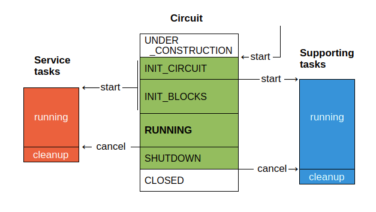

.. currentmodule:: redzed

==============
Circuit runner
==============

The circuit runner is an asynchronous coroutine started with :func:`run`.
The circuit is operational while the coroutine is running.

Applications are supposed to build and run only one circuit.
When the runner terminates, the final state is reached.
A restart is not possible.

Pre-start checklist
===================

- Finished circuit:
    Naturally, a well designed circuit consisting of
    of :ref:`blocks, triggers and formulas <Blocks, Triggers, Formulas>`
    is needed. The circuit cannot be modified after the start.

- Storage for persistent state:
    If there are blocks using :ref:`persistent state <Persistent state>`,
    you need to give the runner access to a persistent storage.
    Skip this step if you don't need it.

Running a circuit
=================

.. function:: run(*coroutines, catch_sigterm: bool = True) -> None
  :async:

  The main entry point. Execute the circuit runner and all supporting *coroutines*.

  :param Coroutine coroutines:

    :ref:`Supporting coroutines <Supporting tasks>` are coroutines intended to run concurrently
    with the circuit runner. Every non-trivial circuit needs at least an
    :ref:`interface <Application interface>`.

  :param bool catch_sigterm:

    When *catch_sigterm* is true (default), a signal handler that shuts down the runner
    upon ``SIGTERM`` delivery will be temporarily installed. This allows for a clean
    remote stop. Note that :func:`run` will return normally in this case.

  In case of a failure, :func:`!run` raises an :exc:`!ExceptionGroup` containing a flat list
  of all errors caught in the circuit runner, in its service tasks and
  and in the supporting tasks. Please remember that their tracebacks correspond
  to the place where the exceptions were caught and reported from.

  .. important::

    When :func:`run` terminates, it cannot be invoked again.

  .. tip::

    Redzed often adds notes with debugging details to exceptions.
    For printing or logging an exception group containing exceptions
    with notes we recommend :func:`traceback.print_exception()`
    and :func:`traceback.format_exception()` from the standard library.

Runner's life-cycle
-------------------

Find below a list of successive steps taken by the runner. They are also reflected in state changes.
See also :meth:`Circuit.get_state` and the corresponding synchronization tool :meth:`Circuit.reached_state`.

1. Start supporting coroutines as individual tasks in a :abbr:`task group (asyncio.TaskGroup)`.
2. Initialize and start all components. Asynchronous block initialization routines
   (if any) are invoked concurrently.
3. Keep the circuit running until shutdown, abort or an error.
   If an error occurs in previous steps, this state won't be reached
   and the runner goes directly to the shutdown state below.
4. Shut the circuit down, in detail:

   - disallow events
   - save states to persistent storage
   - deactivate all trigger blocks
   - call stop/cleanup routines
   - cancel and await service tasks

   Asynchronous cleanup routines (if any) are invoked concurrently.
   Any failures are logged, but the cleanup shall not be interrupted.
   The cleanup could take time up to the largest of all *stop_timeout*
   values (plus some small overhead).
5. Exit the runner, cancel and await the supporting tasks. If any errors were detected
   or were reported with :meth:`Circuit.abort`, raise them all in a :exc:`!ExceptionGroup`.

Stopping the circuit
====================

A running circuit can be stopped either normally with the shutdown
command or due to an error with the abort command.

- In the program:
    Call :meth:`Circuit.shutdown` or :meth:`Circuit.abort`.

  .. important::

    Do not exit the application immediately after stopping the runner.
    Always wait till the :func:`run` function returns.

- From another process:
    By default, sending a ``SIGTERM`` signal will stop the simulation
    with a proper cleanup, of course only if it is running.

    The corresponding signal handler is installed only while :func:`run`
    is actually running.

Supporting tasks
================

Service tasks vs. supporting tasks
----------------------------------

This section focuses on supporting tasks, but let's begin with a side note
about the difference between two main task types in Redzed.

**Service tasks:**
  Service tasks (or coroutines) run Redzed's internal code. They provide
  services to circuit blocks while the circuit is running.
  A service task is typically started by a circuit block that requires
  an async task for its work and for this reason calls :meth:`Circuit.create_service`
  during the initialization. When the circuit
  shuts down, it automatically cancels running service tasks.

**Supporting tasks:**
  Supporting tasks (or coroutines) run application's code. Typically they act
  as an adapter between Redzed's API and the application API.

Start and stop
--------------

Supporting tasks run concurrently with the circuit runner.
They are monitored for an eventual failure. A supporting task
may stop only when cancelled. All other kinds of termination will
abort the circuit runner. Even a normal exit is treated as an error
if it happens before shutdown.

Supporting tasks are started by :func:`run` immediately after starting
the runner. They may assume the circuit blocks are ready to accept events, but their
initialization might be still in progress. For details please read about the
:ref:`initialization process <Initialization process>`.

If the task should start its activity after circuit's initialization, use
:meth:`Circuit.reached_state()` to wait until the initialization finishes.
However, if the task must respond to external requests from the beginning or
plays a role in the initialization process, skip this step.

Supporting tasks are automatically cancelled after the runner's exit. If a cleanup
is needed, use a ``try / except asyncio.CancelledError`` construct. Consider setting
a reasonable timeout for the cleanup. Re-raise the :exc:`!CancelledError` at the end.

Application interface
---------------------

The application interface is the most important supporting task. It is often
the only supporting task. Its main responsibility is to connect circuit inputs
with corresponding data sources. It usually listens on some communication channel for
incoming data and control commands and replies with ACKs, results
or error messages. An interface must take care of:

**Access control**
  An interface may need to enforce access control depending on where
  is the application deployed. If necessary, it must authenticate
  incoming connections and check authorizations before performing actions.

**Processing values**
  Circuit blocks can actively query current values or passively
  wait for updates. Sometimes a subscription is needed to get the updates.
  Input blocks often use both approaches, they query the current value
  during the initialization and then they wait. The interface must convert
  update messages from external sources to internal events.

**Responding to events**
  Blocks waiting for external events rely on the interface to
  forward these events to them.

**Administration tools**
  The interface may accept requests or control commands
  and provide following functions:

  - :ref:`inspecting <Circuit examination>` the circuit. When examining
    states and outputs, it should be possible to return a "snapshot" of the whole
    circuit, because these values are changing in time.
  - stopping the application (circuit :ref:`shutdown <Stopping the circuit>`).
  - enabling/disabling :ref:`debugging <Debug levels>`.
