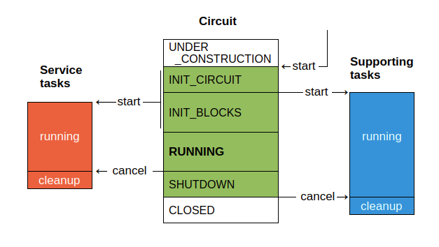

.. currentmodule:: redzed

==============
Circuit runner
==============

The circuit runner is an asynchronous coroutine started with :func:`run`.
The circuit is operational while the coroutine is running.

Applications are supposed to build and run only one circuit.
When the runner terminates, the final state is reached.
A restart is not possible.

Pre-start checklist
===================

- Finished circuit:
    Naturally, a well designed circuit consisting of
    of :ref:`blocks, triggers and formulas <Blocks, Triggers, Formulas>`
    is needed. The circuit cannot be modified after the start.

- Storage for persistent state:
    If there are blocks using :ref:`persistent state <Persistent state>`,
    you need to give the runner access to a persistent storage.
    Skip this step if you don't need it.

Running a circuit
=================

.. function:: run(*coroutines, catch_sigterm: bool = True) -> None
  :async:

  The main entry point. Execute the circuit runner and all supporting *coroutines*
  until shutdown.

  :param Coroutine coroutines:

    :ref:`Supporting coroutines <Supporting tasks>` are coroutines intended to run concurrently
    with the circuit runner. Every non-trivial circuit needs at least an
    :ref:`interface <Application interface>`.

  :param bool catch_sigterm:

    When *catch_sigterm* is true (default), a signal handler that shuts down
    the runner upon ``SIGTERM`` delivery will be installed while :func:`!run`
    is active. This allows for a clean remote stop. Note that :func:`run`
    will return normally in this case.

  In case of a failure, :func:`!run` raises an :exc:`!ExceptionGroup` containing
  a flat list of all errors caught in the circuit runner, in its service tasks
  and supporting tasks. Their tracebacks correspond to the place
  where the exceptions were caught and reported from. The error list
  can be also retrieved with :meth:`Circuit.get_errors`.

  .. important::

    When :func:`run` terminates, it cannot be invoked again.

  .. tip::

    Redzed often adds notes with debugging details to exceptions.
    For printing or logging an exception group containing exceptions
    with notes we recommend :func:`traceback.print_exception()`
    and :func:`traceback.format_exception()` from the standard library.

Runner's life-cycle
-------------------

Find below a list of successive steps taken by the runner together
with the corresponding state changes.

1. state :attr:`CircuitState.INIT_CIRCUIT`:

   a. initialize the circuit
   #. initialize blocks that use only synchronous initializers

#. state :attr:`CircuitState.INIT_BLOCKS`:

   a. allow events
   #. start :ref:`supporting coroutines <Supporting tasks>`
      as individual tasks in a :abbr:`task group (asyncio.TaskGroup)`
   #. initialize blocks with asynchronous initializers; async block initialization
      routines of distinct blocks are invoked concurrently.
      Please read the next section about specifics of
      :ref:`event handling during this phase <Event handling during async initialization>`
   #. enable triggers; run their functions for the first time
   #. start blocks` activities

#. state :attr:`CircuitState.RUNNING`:

   Keep the circuit running until :meth:`Circuit.shutdown`, :meth:`Circuit.abort`
   or an error. If an error occurs in previous steps, this state won't be reached
   and the runner goes directly to the shutdown state below.

#. state :attr:`CircuitState.SHUTDOWN`:

   a. disallow events
   #. save states to persistent storage; close the storage
   #. disable triggers
   #. call :ref:`stop functions <Stop functions>` of output blocks
   #. call sync cleanup routines
   #. cancel and await service tasks
   #. concurrently call async cleanup routines
   #. cancel and await supporting tasks

   Failures are logged, but they don't interrupt the shutdown procedure.
   The whole shutdown could take time up to the largest of all
   :ref:`stop_timeout <6. Shutdown and cleanup>` values (plus overhead).

#. state :attr:`CircuitState.CLOSED`:

   Exit the runner. If any errors were detected or were reported
   with :meth:`Circuit.abort`, raise them all in an :exc:`!ExceptionGroup`.

Event handling during async initialization
------------------------------------------

When all blocks in a circuit utilize only synchronous initializers, there is
a single "switch on" moment after which is the circuit fully initialized and operational.

However, when asynchronous initializers are actively used, that single moment
becomes a time period. Application code running during this period of async
initialization (list item '2c' in the previous section) must take
into account that some blocks may not be initialized yet. Failing to do so
may lead to incorrect circuit responses.

Triggers, formulas and FSM hooks are inactive during the time period in question.
The affected application code can be thus narrowed to handling of
:abbr:`external (forwarded from external systems, as opposed to internally generated)`
events.

Issue 1: destination block is not initialized
+++++++++++++++++++++++++++++++++++++++++++++

When an event arrives to an uninitialized block, the block will first try
to initialize itself and then to handle the event. The event often
fully initializes the block. The exact procedure is:

1. call initializers specified by the *initial* argument
   *except* the async ones and *except* those already tried
2. if still not initialized, call the built-in initializer
3. handle the event - initialized or not

Issue 2 - other block is not initialized
++++++++++++++++++++++++++++++++++++++++

.. important::

  When an application code involved in handling of external events
  fetches an output value from an asynchronously initialized block,
  it must take into account that the value can be :const:`!UNDEF`.
  When it happens, the recommended reaction is to terminate
  the :meth:`Block.event` call with :exc:`CircuitNotReady`.

Example: in the following snippet, the ``auto_blk`` may receive an external ``'start'``
event before the ``enable_blk`` is set to :const:`True` of :const:`False`::

  import redzed as rz

  enable_blk = rz.Memory('enable', validator=bool, initial=rz.InitTask(...))

  class Auto(rz.FSM):
      STATES = ['off', 'on']
      EVENTS = [('start', ['off'], 'on'), ...]
      def cond_start(self):
          # problematic code
          return enable_blk.get()

  auto_blk = Auto('auto')

If that happens, ``enable.blk.get()`` returns :const:`UNDEF`, which is falsey,
and the event will be rejected as if the start action was regularly disabled.
Correct code::

      def cond_start(self):
          if (enabled := enable_blk.get()) is rz.UNDEF:
              raise rz.CircuitNotReady("'enable' value is not available")
          return enabled

Issue 3 - triggers are not activated yet
++++++++++++++++++++++++++++++++++++++++

Before activating its triggers, the circuit waits until all its blocks are initialized.
Waiting for an async initialization of unrelated circuit blocks may create delays
in circuit responses between a successfully handled event and corresponding activation
of triggered functions.

Stopping the circuit
====================

A running circuit can be stopped either normally with the shutdown
command or due to an error with the abort command.

- In the program:
    Call :meth:`Circuit.shutdown` or :meth:`Circuit.abort`.

  .. important::

    Do not exit the application immediately after stopping the runner.
    Always wait till the :func:`run` function returns. Hint: If you can't
    do that directly, use ``await circuit.reached_state('CLOSED')``.

- From another process:
    By default, sending a ``SIGTERM`` signal will properly shut down a running
    simulation. The corresponding signal handler is installed only while
    :func:`run` is actually running.

Supporting tasks
================

Service tasks vs. supporting tasks
----------------------------------

This section focuses on supporting tasks, but let's begin with a side note
about the difference between two main task types in Redzed.

**Service tasks:**
  Service tasks run Redzed's *internal code*. They provide
  services to circuit blocks while the circuit is running.
  Service task are started automatically by circuit blocks that require them.
  When the circuit shuts down, it automatically cancels running service tasks.

**Supporting tasks:**
  Supporting tasks (or coroutines) run *application's code*. Typically they act
  as an adapter between Redzed's API and the application API.

Start and stop
--------------

Supporting tasks run concurrently with the circuit runner.
They are monitored for an eventual failure. A supporting task
may stop only when cancelled. All other kinds of termination will
abort the circuit runner. Even a normal exit is treated as an error
if it happens before shutdown.

Supporting tasks are started by :func:`run` immediately after circuit
initialization. They may assume the circuit blocks are ready to accept events,
but the async part of the initialization might be still in progress
as explained in previous sections.

If the task should start its activity after circuit's initialization, use
:meth:`Circuit.reached_state()` to wait until the initialization finishes.
However, if the task must respond to external requests from the beginning or
plays a role in the initialization process, skip this step.

Supporting tasks are automatically cancelled after the runner's exit. If a cleanup
is needed, use a ``try / except asyncio.CancelledError`` construct. Consider setting
a reasonable timeout for the cleanup. Re-raise the :exc:`!CancelledError` at the end.

Application interface
---------------------

The application interface is the most important supporting task. It is often
the only supporting task. Its main responsibility is to connect circuit inputs
with corresponding data sources. It usually listens on some communication channel for
incoming data and control commands and replies with ACKs, results
or error messages. An interface must take care of:

**Access control**
  An interface may need to enforce access control depending on where
  is the application deployed. If necessary, it must authenticate
  incoming connections and check authorizations before performing actions.

**Processing values**
  Circuit blocks can actively query current values or passively
  wait for updates. Sometimes a subscription is needed to get the updates.
  Input blocks often use both approaches, they query the current value
  during the initialization and then they wait. The interface must convert
  update messages from external sources to internal events.

**Responding to events**
  Blocks waiting for external events rely on the interface to
  forward these events to them.

**Administration tools**
  The interface may accept requests or control commands
  and provide following functions:

  - :ref:`inspecting <Circuit examination>` the circuit. When examining
    states and outputs, it should be possible to return a "snapshot" of the whole
    circuit, because these values are changing in time.
  - stopping the application (circuit :ref:`shutdown <Stopping the circuit>`).
  - enabling/disabling :ref:`debugging <Debug levels>`.
